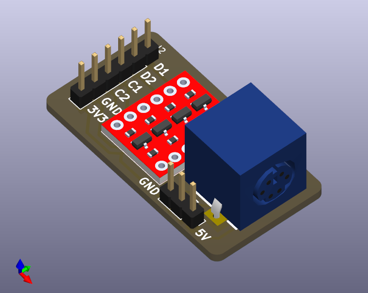
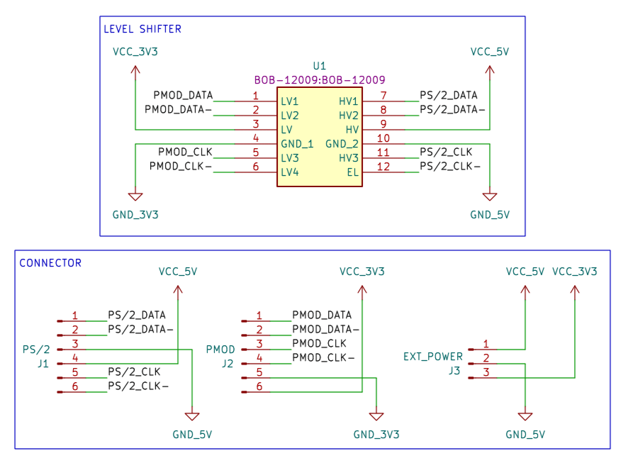

# PS/2 Pmod with Level Shifter

An Open-Source PS/2 Pmod with Level Shifter to convert the PS/2 signal from 5V to 3.3V.

This board support either 3.3V to 5V step-up converter or external 5V input.

This board intended to use for FPGA projects.

# Schematic

# Required Components

| Reference | Part Number | Description |
|-|-|-|
| U1 | [BOB-12009](https://www.sparkfun.com/products/12009) | Sparkfun Bi-Directional Logic Level Converter, clones are compatible |
| J1 | [PS/2 Connector](https://www.amazon.co.jp/dp/B09HWT37YP) | PS/2 Connector/6-Pin Mini DIN Connector |
| J2 | [Right Angle Pin Header](https://www.amazon.co.jp/dp/B010ESD338) | 1x6 2.54mm Right Angle Male Pin Header |
| J3 | [AE-XC9306-5V0](https://akizukidenshi.com/catalog/g/g115775/) | XC9306 5V Step-up Power Module |

If you want to use external power input instead of step-up converter replace J3 with Pin Header.

| Reference | Part Number | Description |
|-|-|-|
| J3 | [Pin Header](https://www.amazon.co.jp/dp/B017IPWYDK) | 1x2 2.54mm Male Pin Header |

**Attached links are for reference only, you can use any equivalent parts.**

# How to Order Board

To order a board, use the `gerbers.zip` from the release page or generate one yourself. You can order from your favourite PCB manufacturer ([JLCPCB](https://jlcpcb.com/), [PCBWay](https://www.pcbway.com/), etc.).

You can choose any colour for the Solder Mask and Silkscreen.

# How to Use Board

Connect the Pmod to your board, and connect the 5V and GND cable to power source.

# References

- Logic Level Converter (BOB-12009) Footprint: https://www.snapeda.com/parts/BOB-12009/SparkFun%20Electronics/view-part/
- PS/2 Connector (Mini-DIN 6 Pins) Footprint: https://www.reniemarquet.com/bibliotecas_en.html
- Digilent Pmod PS2: https://digilent.com/reference/pmod/pmodps2/start
- Akizuki Denshi XC9306 5V Step-up Modules: https://akizukidenshi.com/catalog/g/g115775/
